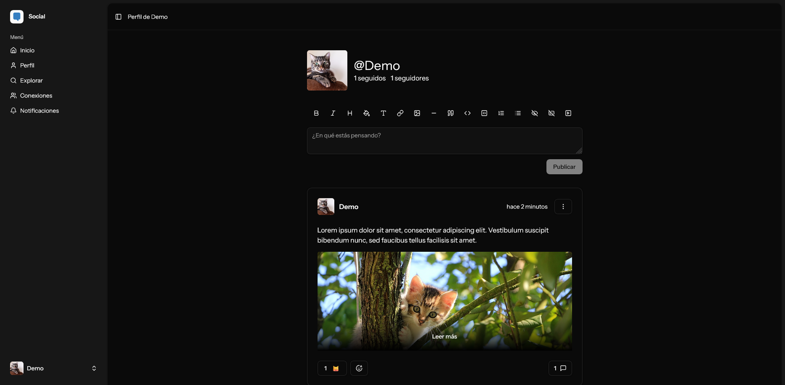

# Social

**Social** es una red social sencilla desarrollada con Laravel, Inertia.js y React, basada en la _starter kit_ oficial de Laravel 12. El proyecto busca ofrecer una experiencia minimalista y centrada en las interacciones básicas entre usuarios.

> **Estado del proyecto:** en desarrollo activo. Algunas funcionalidades están incompletas, en etapa de prueba o pendientes de implementación. Se esperan errores.



## Funcionalidades principales

- **Publicaciones y comentarios**
    - Permite publicar contenido con formato básico utilizando Markdown.
    - Permite **mencionar a otros usuarios** y usar **hashtags**.
    - Permite **reaccionar** con **emojis**.
- **Inicio**
    - Muestra publicaciones recientes de los usuarios seguidos.
- **Perfiles públicos**
    - Página pública con información del usuario y sus publicaciones.
- **Sistema de seguimiento**
    - Seguir y dejar de seguir a otros usuarios.
    - Listado de seguidores y seguidos.
- **Bloqueo de usuarios**
    - Posibilidad de bloquear usuarios para evitar interacción.
- **Búsqueda**
    - Búsqueda unificada por publicaciones o usuarios.
- **Notificaciones** _(en desarrollo)_
    - Sistema de notificaciones en construcción.
- **Panel de administración** _(en desarrollo)_
    - Funcionalidades administrativas para la gestión de usuarios en desarrollo.
- **Multilenguaje**
    - Interfaz disponible en varios idiomas, con detección automática del idioma preferido o selección manual.

## Instalación

### Instalación con Docker

1. Asegúrate de tener instalado [Docker](https://www.docker.com/products/docker-desktop/) y que el servicio esté en ejecución.
2. Descarga o clona este repositorio y accede a la carpeta del proyecto.
3. Renombra el archivo `.env.example` a `.env`.
4. Abre la terminal y ejecuta lo siguiente para instalar las dependencias y levantar los contenedores:

```
docker compose up --build
```

5. Abre `http://localhost/` en tu navegador para ver la aplicación.
6. Abre `http://localhost:8025/` para acceder a MailHog.

### Instalación manual

#### Requisitos

- [PHP 8.3](https://www.php.net/downloads)
- [Composer](https://getcomposer.org/download/)
- Servidor [MySQL 9.3](https://dev.mysql.com/downloads/mysql/) iniciado con base de datos creada.
- [Node.js](https://nodejs.org/es/download)
- [MailHog 1.0.1](https://github.com/mailhog/MailHog/releases/tag/v1.0.1) en ejecución.

#### Instalación y configuración

1. Descarga o clona este repositorio y accede a la carpeta del proyecto.
2. Renombra el archivo `.env.example` a `.env`.
3. Abre el archivo `.env` y reemplaza el bloque `DB_` con tus datos:

```
DB_CONNECTION=mysql
DB_HOST=127.0.0.1
DB_PORT=3306
DB_DATABASE=EL_NOMBRE_DE_LA_BASE_DE_DATOS
DB_USERNAME=EL_USUARIO_DE_LA_BASE_DE_DATOS
DB_PASSWORD=LA_CONTRASEÑA_DE_LA_BASE_DE_DATOS
```

4. Ejecuta en la terminal lo siguiente para instalar las dependencias PHP:

```
composer install
```

5. Ejecuta lo siguiente para generar la clave de la aplicación:

```
php artisan key:generate
```

6. Ejecuta lo siguiente para crear el enlace simbólico para el acceso público a archivos:

```
php artisan storage:link
```

7. Ejecuta lo siguiente para realizar las migraciones:

```
php artisan migrate
```

8. Ejecuta lo siguiente para instalar las dependencias JavaScript:

```
npm install
```

#### Visualización

1. En la raíz del proyecto, abre la terminal y ejecuta lo siguiente para iniciar las colas:

```
php artisan queue:listen
```

2. Abre otra terminal y ejecuta lo siguiente para iniciar el servidor WebSocket de Reverb:

```
php artisan reverb:start
```

3. En una tercera terminal, ejecuta lo siguiente para iniciar el servidor web:

```
php artisan serve
```

4. En otra terminal, ejecuta lo siguiente para iniciar el entorno de desarrollo de Vite:

```
npm run dev
```

5. Abre `http://localhost:8000/` en tu navegador para visualizar la aplicación.
6. Abre `http://localhost:8025/` para acceder a MailHog.

## Consideraciones

La **primera cuenta registrada** se asignará automáticamente con **rol de administrador**.
