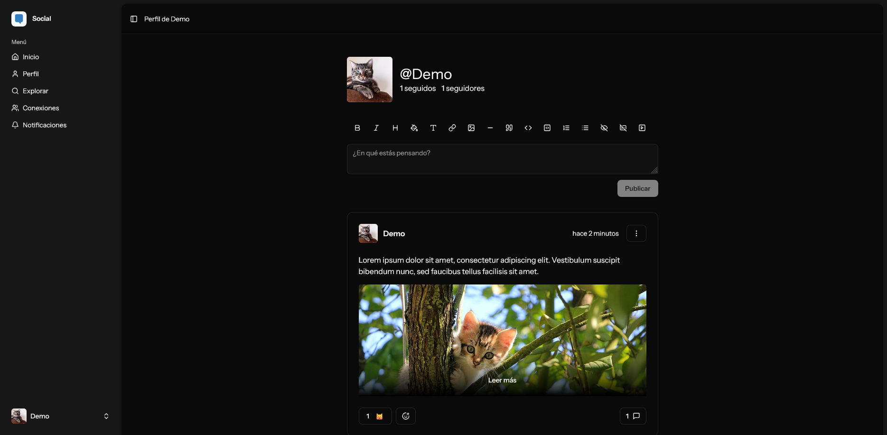

# Social

**Social** es una red social sencilla desarrollada con Laravel, Inertia.js y React, basada en la _starter kit_ oficial de Laravel 12. El proyecto busca ofrecer una experiencia minimalista y centrada en las interacciones básicas entre usuarios.

> **Estado del proyecto:** en desarrollo activo. Algunas funcionalidades están incompletas, en etapa de prueba o pendientes de implementación. No se ha realizado un testeo intensivo aún.



## Funcionalidades principales

- **Publicaciones y comentarios**
    - Permite publicar contenido con soporte básico para Markdown.
    - Se puede **mencionar a otros usuarios** y usar **hashtags**.
    - Se puede **reaccionar** con **emojis**.
- **Inicio**
    - Muestra publicaciones recientes de los usuarios seguidos.
- **Perfiles públicos**
    - Página pública con información del usuario y sus publicaciones.
- **Sistema de seguimiento**
    - Seguir y dejar de seguir a otros usuarios.
    - Listado de seguidores y seguidos.
- **Bloqueo de usuarios**
    - Posibilidad de bloquear usuarios para evitar interacción.
- **Búsqueda**
    - Búsqueda unificada por publicaciones o usuarios.
    - Soporte de etiquetas `#hashtag`.
- **Notificaciones** _(en desarrollo)_
    - Se está trabajando en el sistema de notificaciones.
- **Panel de administración** _(próximamente)_
    - Funcionalidades administrativas para gestión de usuarios.

## Instalación

1. Asegúrate de tener instalado Docker y su servicio en ejecución.
2. Descarga o clona este repositorio e ingresa a él.
3. Renombra el archivo `.env.example` a `.env`.
4. Abre el terminal y ejecuta lo siguiente para instalar y poner en marcha los contenedores:

```
docker compose up --build
```

5. Abre el navegador web y visita la dirección `http://localhost/`.
